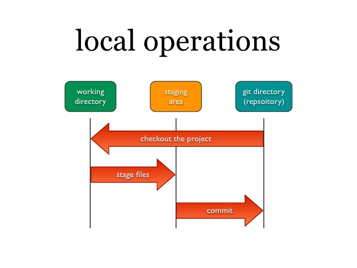

# GIT Información
Se presenta a continuación información util para el manejo de git y github.



*   ```git init```: Con este comando inicializamos el versionamiento en nuestro proyecto.
*   ```git status```: Con este comando podremos saber el estado del proyecto, archivos modificados, creados, en staging area y listos para repositorio.
*   ```git add -A```: Con este comando agregamos los archivos al area de espera.
*   ```git commit -m "first Commit"```: Ahora agregamos el proyecto al area del repositorio para poder publicarlo al repositorio.

*   ```git clone URL-Repositorio```: con este comando se podra clonar el proyecto del repositorio de la url, de debe tener en cuenta de que se hay archivos importantes para el funcionamiento de proyecto mencionados en el **.gitignore** entonces no funcionara el proyecto al ejecutarlo despues de clonarlo.

*   ```git branch```: Con este comando podremos ver las ramas en el proyecto y estara remarcada la rama en la que te encuentras.
*   ```git branch NameRama```: Para poder cerar una rama usaremos este comando.
*   ```git branch -D NameRama```: Este comando sirve para eliminar una rama.
*   ```git checkout NameRama```: Para poder posicionarnos en una de las ramas que existen en nuestro proyecto
* ```git checkout -b NameRama```: Este comando crea la rama y despues nos pone en esa rama.
*   ```git merge RamaAFucionar```: Para poder fucionar una rama a otra utilizaremos este comando.
*   ```git remote add origin UrlRepositorio```: Para poder conectar nuestro proyecto a un repositorio remoto en github usamos este comando.

*   ```git remote -v```: para poder ver el repositorio al cual estamos conectados.
*   ```git remote remove origin```: Para eliminar esa conexion con el repositorio remoto.

*   ```git push origin NameRama```: Para subir el proyecto al repositorio remoto usamos este comando.

*   ```git commit --amend -m "cambio de nombre de git"```: Comando que nos sirve para poder cambiar el nombre del ultimo git que hicimos.

*   ```git push origin master -f```: Fuerza la subida del repositorio local al repositorio remoto.

*   ```git tag -a v1.0 -m "MENSAJE" ```: Las tags anotadas son almacenadas como objetos completos dentro de la base de Git y contienen mas información, se le asigana el tag al ultimo commit.

*   ```git tag v1.0``` : Las tags ligeras, son otra forma de crear tags, más simples y con poca información.

*   ```git tag -a v1.0 -m "MENSAJE" Codigo-SHA```: De este modo podemos especificar en que commit se va a aplicar el tag. El codigo SHA es el codigo de nuestro commit, lo podemos observar con el comando ```git log ```.

*   ```git push origin TAG-Name```: De este modo subimos nuestro tag a nuestro repositorio remoto.

*   ```git push origin --tags```: Para subir todos los tags al repositorio remoto.

## Workflow

*   ```git branch -a```: Para mostrar las ramas ocultas.

*   ```git fetch origin```: Baja los cambios del repositorio remoto a la rama oculta origin/master.

*   ```git merge origin/NAME-RAMA```: Para combinar nuestra rama local con la rama origin/master.

## Conflict
 Cuando un colaborador del proyecto sube una actualización del proyecto y otro colaborardor trata de actualizar abra un conflicto de versiones.
